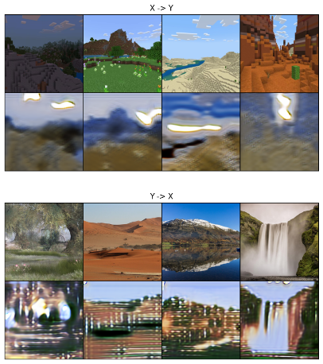
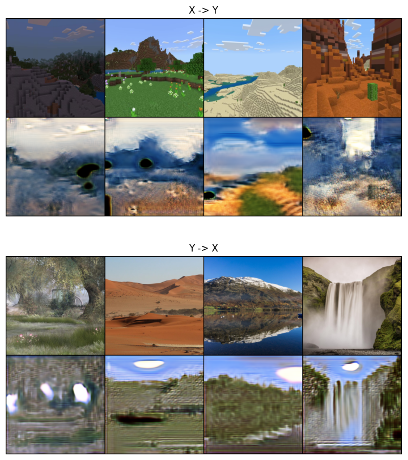
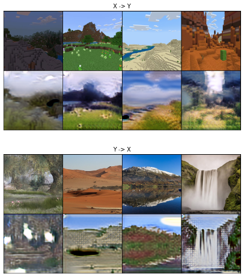
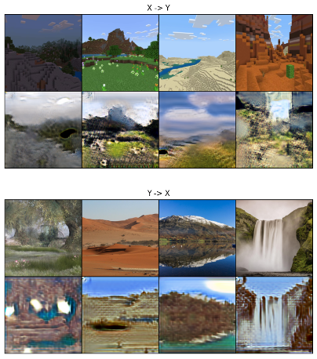

# Minecraft2Real — CycleGAN Image Translation

This project implements **CycleGAN in PyTorch** to translate between two unpaired visual domains:

- **Minecraft landscapes → photorealistic landscapes**
- **Real landscapes → Minecraft-style scenes**

The goal is to learn structural correspondences between highly different visual distributions without paired training data.

---

## Dataset

Inspired by GTA-to-landscape translation tasks, we construct two image domains:

**Domain X — Minecraft landscapes**  
444 screenshots from the Kaggle dataset 
`coreydobbs/minecraft-landscapes`. (Took every 10th images for uniqueness and avoiding missing out)

**Domain Y — Real landscapes**  
1,663 curated landscape photographs from  
`xuehancarina/cleaned-landscape-for-cyclegan`. (Manually cleaned and uploaded on my Kaggle)

During early experiments we found that generic landscape photos produced poor results because CycleGAN primarily learns **texture and color mappings rather than geometry**. We therefore **manually cleaned the dataset** by removing:

- images containing buildings or people  
- high depth-of-field photography  
- sky-dominant scenes  
- overly complex gradient textures  
- duplicate images

Images are split **90/10 for train/test**.

---

## Preprocessing

Images are resized and normalized before training.

- Random crop: **256×256 from 286×286**
- Random horizontal flip (training)
- Center crop (testing)
- Pixel normalization to **[-1, 1]**

Since the domains are unpaired, images from X and Y are **randomly matched each iteration**.

---

## Architecture

### Generators

Both generators follow the original **CycleGAN encoder–residual–decoder architecture**:

- 3 downsampling convolutions
- **9 residual blocks**
- bilinear upsampling decoder
- **instance normalization** throughout

Design choices:

- **Reflection padding** to reduce boundary artifacts  
- **Dropout (0.2)** in residual blocks for regularization  
- **Bilinear upsampling instead of transpose convolution** to avoid checkerboard artifacts

Weights are initialized from **N(0, 0.02)**.

---

### Discriminators

We use a **70×70 PatchGAN discriminator**, producing a grid of real/fake predictions instead of a single score.

This focuses the model on **local texture realism**, which is important when translating Minecraft’s block textures into natural terrain.

Additional stabilization:

- **Spectral normalization** on deeper layers  
- **LeakyReLU(0.2)** activation

---

## Training

Training uses standard CycleGAN objectives:

- **Adversarial loss (MSE)**
- **Cycle-consistency loss (L1)**
- **Identity loss (L1)**

Loss weights:

```
loss_G = loss_GAN + λ_cycle · loss_cycle + λ_id · loss_identity
```

Hyperparameters:

- λ_cycle = **10.0**
- λ_id = **0.5**

Reducing λ_id from the default value allowed the generator to explore richer natural textures.

---

## Edge-Weighted Cycle Loss

Minecraft skies are extremely uniform, while real skies contain gradients and lighting variation.  
This often caused artifacts during training.

To address this, we introduce an **edge-weighted cycle loss**:

- A **Sobel filter** computes gradient magnitude.
- High-frequency regions (terrain, cliffs, grass) receive higher weight.
- Low-frequency regions (sky, water) receive lower weight.

This encourages the generator to focus on meaningful texture differences rather than flat regions.

---

## Optimization Strategy

To prevent the discriminator from dominating training:

- Generator learning rate: **0.0002**
- Discriminator learning rate: **0.0001**

Training schedule:

- **40 epochs** base learning rate  
- **20 epochs** reduced learning rate (÷10)

Best visual results appeared around **epoch 49**.

Each epoch processes **~1000 image pairs**.

---

## Results

The model learns meaningful correspondences between the two domains:

- **Minecraft → Real:** smooth natural terrain while preserving scene layout  
- **Real → Minecraft:** block-like geometry and grid textures emerge

The edge-weighted cycle loss helps produce **smoother skies and water regions** while maintaining terrain detail.

Remaining challenges include occasional texture artifacts and smoothing of staircase structures.

## Training Progress


| Epoch 5 | Epoch 25 |
|--------|---------|
|  |  |

| Epoch 39 (before LR decay) | Epoch 49 (final result) |
|-----------------------------|-------------------------|
|  |  |

More results are avaliable in images or with result.ipynb

## References

Zhu et al., *Unpaired Image-to-Image Translation using Cycle-Consistent Adversarial Networks*, ICCV 2017.

Miyato et al., *Spectral Normalization for GANs*, ICLR 2018.
